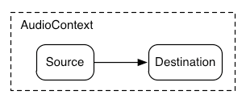
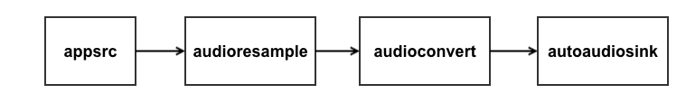
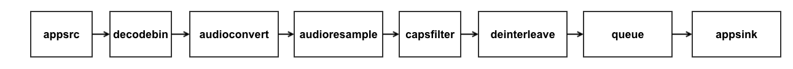

# WebAudio

The [WebAudio API](https://webaudio.github.io/web-audio-api/) is a high-level JavaScript API for processing and synthesizing audio in web applications.

WebAudio uses a [Modular Routing](https://webaudio.github.io/web-audio-api/#ModularRouting) based model for processing audio, that allows connecting multiple different [AudioNode](https://github.com/servo/media/blob/2610789d1abfbe4443579021113c822ba05f34dc/audio/node.rs#L122) inputs and/or outputs and make the audio flow through these connected nodes. In this model, nodes can be `sources` (no inputs and a single output), `destinations` (one input and no output) or `filters` (one or multiple inputs and outputs). The simplest example is a single source routed directly to the output.



In WebAudio everything happens within an [AudioContext](https://github.com/servo/media/blob/2610789d1abfbe4443579021113c822ba05f34dc/audio/context.rs#L105) instance that manages and plays all sounds to its single [AudioDestinationNode](https://github.com/servo/media/blob/2610789d1abfbe4443579021113c822ba05f34dc/audio/destination_node.rs#L6). The audio can be rendered to hardware or to a buffer, for example, through [OfflineAudioContext](https://github.com/servo/media/blob/2610789d1abfbe4443579021113c822ba05f34dc/audio/context.rs#L94). 

The `servo-media` Rust API for WebAudio is deliverately close to the actual WebAudio JavaScript API.

```rust
/*
  This is an example of a very basic WebAudio pipeline with an OscillatorNode connected to a GainNode.
  ------------------------------------------------------------
  |  AudioContext                                            |
  |      OscillatorNode -> GainNode -> AudioDestinationNode  |
  ------------------------------------------------------------
  NOTE: Some boilerplate has been removed for simplicity.
  Please, visit the examples folder for a more complete version.
*/

// Context creation.
let context =
  servo_media.create_audio_context(&ClientContextId::build(1, 1), Default::default());

// Create and configure nodes.
let osc = context.create_node(
  AudioNodeInit::OscillatorNode(Default::default()),
  Default::default(),
).expect("Failed to create oscillator node");
let mut options = GainNodeOptions::default();
options.gain = 0.5;
let gain = context.create_node(AudioNodeInit::GainNode(options), Default::default())
  .expect("Failed to create gain node");

// Connect nodes.
let dest = context.dest_node();
context.connect_ports(osc.output(0), gain.input(0));
context.connect_ports(gain.output(0), dest.input(0));

// Start playing.
context.message_node(
  osc,
  AudioNodeMessage::AudioScheduledSourceNode(AudioScheduledSourceNodeMessage::Start(0.)),
);
```

## Implementation

### Threading model

Following the [WebAudio API specification](https://webaudio.github.io/web-audio-api/#control-thread-and-rendering-thread), `servo-media` implements the concepts of [control thread](https://webaudio.github.io/web-audio-api/#control-thread) and [rendering thread](https://webaudio.github.io/web-audio-api/#rendering-thread).

The `control thread` is the thread from which the `AudioContext` is instantiated and from which authors manipulate the audio graph. In Servo's case, this is the [script](https://github.com/servo/servo/blob/594ea14d5bd7b76d09b679fd0454165259ffbe7a/components/script/script_thread.rs#L5) thread.

The `rendering thread` is where the magic and the actual audio processing happens. This thread keeps an [event loop](https://github.com/servo/media/blob/2610789d1abfbe4443579021113c822ba05f34dc/audio/render_thread.rs#L250) that listens and handles control messages coming from the `control thread` and the audio backend and processes the audio coming from the audio graph in blocks of 128 samples-frames called [render quantums](https://webaudio.github.io/web-audio-api/#render-quantum). For each spin of the loop, the [AudioRenderThread.process](https://github.com/servo/media/blob/2610789d1abfbe4443579021113c822ba05f34dc/audio/render_thread.rs#L233) method is called. This method internally runs a [DFS](https://en.wikipedia.org/wiki/Depth-first_search) traversal on the internal graph calling the [process](https://github.com/servo/media/blob/main/audio/node.rs#L126) method for each node. The resulting chunk of audio data is [pushed](https://github.com/servo/media/blob/2610789d1abfbe4443579021113c822ba05f34dc/audio/render_thread.rs#L337) to the audio sink.

### Audio Playback

WebAudio allows clients to render the processed audio to hardware or to an audio buffer. To abstract this behavior, `servo-media` exposes the [AudioSink](https://github.com/servo/media/blob/2610789d1abfbe4443579021113c822ba05f34dc/audio/sink.rs#L16) trait.

For offline rendering to an audio buffer, there is an [OfflineAudioSink](https://github.com/servo/media/blob/2610789d1abfbe4443579021113c822ba05f34dc/audio/offline_sink.rs#L38) implementation of the `AudioSink` trait.

For hardware rendering, the `AudioSink` trait is expected to be implemented by the media backends. For `GStreamer` the [implementation](https://github.com/servo/media/blob/2610789d1abfbe4443579021113c822ba05f34dc/backends/gstreamer/audio_sink.rs#L73) creates a simple audio pipeline as the following:



The core piece of the audio sink is the initial [appsrc](https://gstreamer.freedesktop.org/documentation/applib/gstappsrc.html?gi-language=c) element, that we use to insert the audio chunks into the GStreamer pipeline. We use the `appsrc` in push mode, where we repeatedly call the [push-buffer](https://gstreamer.freedesktop.org/documentation/applib/gstappsrc.html?gi-language=c#gst_app_src_push_buffer) method with a new buffer.
To make audio playback nice and smooth and to continue processing control events coming from the `control thread`, we cannot use the appsrc's `block` property, that would essentially block the render thread when we fill the appsrc internal queue. Instead, we set the maximum amount of bytes that can be queued in the appsrc to 1 and use a combination of [get_current_level_bytes](https://gstreamer.freedesktop.org/documentation/applib/gstappsrc.html?gi-language=c#gst_app_src_get_current_level_bytes) and the [need-data](https://gstreamer.freedesktop.org/documentation/applib/gstappsrc.html?gi-language=c#GstAppSrc::need-data) signal to decide whether we should push the new audio buffer or not.

### Audio Decoding

WebAudio also supports decoding audio data.

`servo-media` exposes a very simple [AudioDecoder](https://github.com/ferjm/media/blob/a95e063729324c359976236104d825244bb180e8/servo-media/src/audio/decoder.rs#L92) trait, that exposes a single `decode` method taking among other arguments the audio data to be decoded and an instance of [AudioDecoderCallbacks](https://github.com/ferjm/media/blob/a95e063729324c359976236104d825244bb180e8/servo-media/src/audio/decoder.rs#L1) containing the callbacks for the end-of-stream, error and progress events that are triggered during the decoding process.

`servo-media` backends are required to implement this trait.

The GStreamer backend implementation of the `AudioDecoder` trait creates a pipeline that has this form:



The `decodebin` element is the core element of this pipeline and it auto-magically constructs a decoding pipeline using available decoders and demuxers via auto-plugging.


