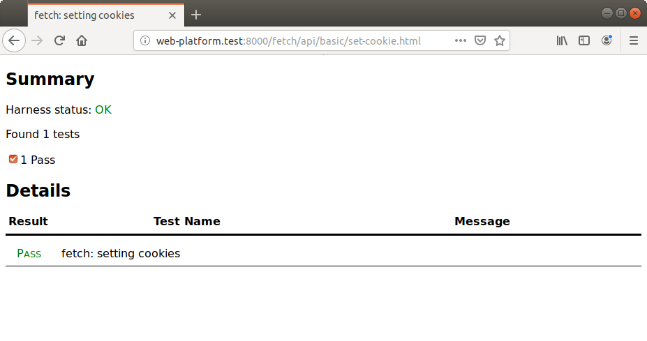
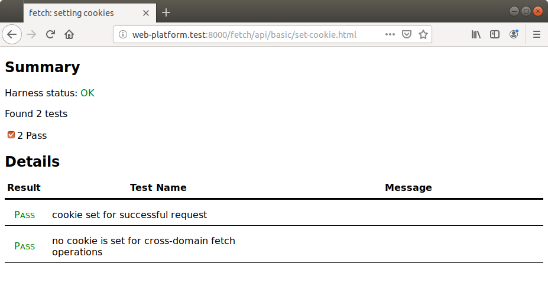

# testharness.js tutorial

<!--
Note to maintainers:

This tutorial is designed to be an authentic depiction of the WPT contribution
experience. It is not intended to be comprehensive; its scope is intentionally
limited in order to demonstrate authoring a complete test without overwhelming
the reader with features. Because typical WPT usage patterns change over time,
this should be updated periodically; please weigh extensions against the
demotivating effect that a lengthy guide can have on new contributors.
-->

Let's say you've discovered that WPT doesn't have any tests for how [the Fetch
API](https://fetch.spec.whatwg.org/) sets cookies from an HTTP response. This
tutorial will guide you through the process of writing a test for the
web-platform, verifying it, and submitting it back to WPT. Although it includes
some very brief instructions on using git, you can find more guidance in [the
tutorial for git and GitHub](github-intro).

WPT's testharness.js is a framework designed to help people write tests for the
web platform's JavaScript APIs. [The testharness.js reference
page](testharness) describes the framework in the abstract, but for the
purposes of this guide, we'll only consider the features we need to test the
behavior of `fetch`.

```eval_rst
.. contents:: Table of Contents
   :depth: 3
   :local:
   :backlinks: none
```

## Setting up your workspace

To make sure you have the latest code, first type the following into a terminal
located in the root of the WPT git repository:

    $ git fetch git@github.com:web-platform-tests/wpt.git

Next, we need a place to store the change set we're about to author. Here's how
to create a new git branch named `fetch-cookie` from the revision of WPT we
just downloaded:

    $ git checkout -b fetch-cookie FETCH_HEAD

The tests we're going to write will rely on special abilities of the WPT
server, so you'll also need to [configure your system to run
WPT](../running-tests/from-local-system) before you continue.

With that out of the way, you're ready to create your patch.

## Writing a subtest

<!--
Goals of this section:

- demonstrate asynchronous testing with Promises
- motivate non-trivial integration with WPT server
- use web technology likely to be familiar to web developers
- use web technology likely to be supported in the reader's browser
-->

The first thing we'll do is configure the server to respond to a certain request
by setting a cookie. Once that's done, we'll be able to make the request with
`fetch` and verify that it interpreted the response correctly.

We'll configure the server with an "asis" file. That's the WPT convention for
controlling the contents of an HTTP response. [You can read more about it
here](server-features), but for now, we'll save the following text into a file
named `set-cookie.asis` in the `fetch/api/basic/` directory of WPT:

```
HTTP/1.1 204 No Content
Set-Cookie: test1=t1
```

With this in place, any requests to `/fetch/api/basic/set-cookie.asis` will
receive an HTTP 204 response that sets the cookie named `test1`. When writing
more tests in the future, you may want the server to behave more dynamically.
In that case, [you can write Python code to control how the server
responds](python-handlers/index).

Now, we can write the test! Create a new file named `set-cookie.html` in the
same directory and insert the following text:

```html
<!DOCTYPE html>
<meta charset="utf-8">
<title>fetch: setting cookies</title>
<script src="/resources/testharness.js"></script>
<script src="/resources/testharnessreport.js"></script>

<script>
promise_test(function() {
  return fetch('set-cookie.asis')
    .then(function() {
        assert_equals(document.cookie, 'test1=t1');
      });
});
</script>
```

Let's step through each part of this file.

- ```html
  <!DOCTYPE html>
  <meta charset="utf-8">
  ```

  We explicitly set the DOCTYPE and character set to be sure that browsers
  don't infer them to be something we aren't expecting. We're omitting the
  `<html>` and `<head>` tags. That's a common practice in WPT, preferred
  because it makes tests more concise.

- ```html
  <title>fetch: setting cookies</title>
  ```
  The document's title should succinctly describe the feature under test.

- ```html
  <script src="/resources/testharness.js"></script>
  <script src="/resources/testharnessreport.js"></script>
  ```

  These two `<script>` tags retrieve the code that powers testharness.js. A
  testharness.js test can't run without them!

- ```html
  <script>
  promise_test(function() {
    return fetch('thing.asis')
      .then(function() {
          assert_equals(document.cookie, 'test1=t1');
        });
  });
  </script>
  ```

  This script uses the testharness.js function `promise_test` to define a
  "subtest". We're using that because the behavior we're testing is
  asynchronous. By returning a Promise value, we tell the harness to wait until
  that Promise settles. The harness will report that the test has passed if
  the Promise is fulfilled, and it will report that the test has failed if the
  Promise is rejected.

  We invoke the global `fetch` function to exercise the "behavior under test,"
  and in the fulfillment handler, we verify that the expected cookie is set.
  We're using the testharness.js `assert_equals` function to verify that the
  value is correct; the function will throw an error otherwise. That will cause
  the Promise to be rejected, and *that* will cause the harness to report a
  failure.

If you run the server according to the instructions in [the guide for local
configuration](../running-tests/from-local-system), you can access the test at
[http://web-platform.test:8000/fetch/api/basic/set-cookie.html](http://web-platform.test:8000/fetch/api/basic/set-cookie.html.).
You should see something like this:



## Refining the subtest

<!--
Goals of this section:

- explain the motivation for "clean up" logic and demonstrate its usage
- motivate explicit test naming
-->

We'd like to test a little more about `fetch` and cookies, but before we do,
there are some improvements we can make to what we've written so far.

For instance, we should remove the cookie after the subtest is complete. This
ensures a consistent state for any additional subtests we may add and also for
any tests that follow. We'll use the `add_cleanup` method to ensure that the
cookie is deleted even if the test fails.

```diff
-promise_test(function() {
+promise_test(function(t) {
+  t.add_cleanup(function() {
+    document.cookie = 'test1=;expires=Thu, 01 Jan 1970 00:00:01 GMT;';
+  });
+
   return fetch('thing.asis')
     .then(function() {
         assert_equals(document.cookie, 'test1=t1');
       });
 });
```

Although we'd prefer it if there were no other cookies defined during our test,
we shouldn't take that for granted. As written, the test will fail if the
`document.cookie` includes additional cookies. We'll use slightly more
complicated logic to test for the presence of the expected cookie.


```diff
 promise_test(function(t) {
   t.add_cleanup(function() {
     document.cookie = 'test1=;expires=Thu, 01 Jan 1970 00:00:01 GMT;';
   });

   return fetch('thing.asis')
     .then(function() {
-        assert_equals(document.cookie, 'test1=t1');
+        assert_true(/(^|; )test1=t1($|;)/.test(document.cookie);
       });
 });
```

In the screen shot above, the subtest's result was reported using the
document's title, "fetch: setting cookies". Since we expect to add another
subtest, we should give this one a more specific name:

```diff
 promise_test(function(t) {
   t.add_cleanup(function() {
     document.cookie = 'test1=;expires=Thu, 01 Jan 1970 00:00:01 GMT;';
   });

   return fetch('thing.asis')
     .then(function() {
         assert_true(/(^|; )test1=t1($|;)/.test(document.cookie));
       });
-});
+}, 'cookie set for successful request');
```

## Writing a second subtest

<!--
Goals of this section:

- introduce the concept of cross-domain testing and the associated tooling
- demonstrate how to verify promise rejection
- demonstrate additional assertion functions
-->

There are many things we might want to verify about how `fetch` sets cookies.
For instance, it should *not* set a cookie if the request fails due to
cross-origin security restrictions. Let's write a subtest which verifies that.

We'll add another `<script>` tag for a JavaScript support file:

```diff
 <!DOCTYPE html>
 <meta charset="utf-8">
 <title>fetch: setting cookies</title>
 <script src="/resources/testharness.js"></script>
 <script src="/resources/testharnessreport.js"></script>
+<script src="/common/get-host-info.sub.js"></script>
```

`get-host-info.sub.js` is a general-purpose script provided by WPT. It's
designed to help with testing cross-domain functionality. Since it's stored in
WPT's `common/` directory, tests from all sorts of specifications rely on it.

Next, we'll define the new subtest inside the same `<script>` tag that holds
our first subtest.

```js
promise_test(function(t) {
  t.add_cleanup(function() {
    document.cookie = 'test1=;expires=Thu, 01 Jan 1970 00:00:01 GMT;';
  });
  const url = get_host_info().HTTP_NOTSAMESITE_ORIGIN +
    '/fetch/api/basic/set-cookie.asis';

  return fetch(url)
    .then(function() {
        assert_unreached('The promise for the aborted fetch operation should reject.');
      }, function() {
        assert_false(/(^|; )test1=t1($|;)/.test(document.cookie));
      });
}, 'no cookie is set for cross-domain fetch operations');
```

This may look familiar from the previous subtest, but there are some important
differences.

- ```js
  const url = get_host_info().HTTP_NOTSAMESITE_ORIGIN +
    '/fetch/api/basic/set-cookie.asis';
  ```

  We're requesting the same resource, but we're referring to it with an
  alternate host name. The name of the host depends on how the WPT server has
  been configured, so we rely on the helper to provide an appropriate value.

- ```js
  return fetch(url)
    .then(function() {
        assert_unreached('The promise for the aborted fetch operation should reject.');
      }, function() {
        assert_false(/(^|; )test1=t1($|;)/.test(document.cookie));
      });
  ```

  We're returning a Promise value, just like the first subtest. This time, we
  expect the operation to fail, so the Promise should be rejected. To express
  this, we've used `assert_unreached` *in the fulfillment handler*.
  `assert_unreached` is a testharness.js utility function which always throws
  an error. With this in place, if fetch does *not* produce an error, then this
  subtest will fail.

  We've moved the assertion about the cookie to the rejection handler. We also
  switched from `assert_true` to `assert_false` because the test should only
  pass if the cookie is *not* set. It's a good thing we have the cleanup logic
  in the previous subtest, right?

If you run the test in your browser now, you can expect to see both tests
reported as passing with their distinct names.



## Verifying our work

We're done writing the test, but we should make sure it fits in with the rest
of WPT before we submit it.

[The lint tool](lint-tool) can detect some of the common mistakes people make
when contributing to WPT. You enabled it when you [configured your system to
work with WPT](../running-tests/from-local-system). To run it, open a
command-line terminal, navigate to the root of the WPT repository, and enter
the following command:

    python ./wpt lint fetch/api/basic

If this recognizes any of those common mistakes in the new files, it will tell
you where they are and how to fix them. If you do have changes to make, you can
run the command again to make sure you got them right.

Now, we'll run the test using the automated test runner. This is important for
testharness.js tests because there are subtleties of the automated test runner
which can influence how the test behaves. That's not to say your test has to
pass in all browsers (or even in *any* browser). But if we expect the test to
pass, then running it this way will help us catch other kinds of mistakes.

The tools support running the tests in many different browsers. We'll use
Firefox this time:

    python ./wpt run firefox fetch/api/basic/set-cookie.html

We expect this test to pass, so if it does, we're ready to submit it. If we
were testing a web-platform feature that Firefox didn't support, we would
expect the test to fail instead.

There are a few problems to look out for in addition to passing/failing status.
The report will describe fewer tests than we expect if the test isn't run at
all. That's usually a sign of a formatting mistake, so you'll want to make sure
you've used the right file names and metadata. Separately, the web browser
might crash. That's often a sign of a browser bug, so you should consider
[reporting it to the browser's
maintainers](https://rachelandrew.co.uk/archives/2017/01/30/reporting-browser-bugs/)!

## Submitting the test

First, let's stage the new files for committing:

    $ git add fetch/api/basic/set-cookie.asis
    $ git add fetch/api/basic/set-cookie.html

We can make sure the commit has everything we want to submit (and nothing we
don't) by using `git diff`:

    $ git diff --staged

On most systems, you can use the arrow keys to navigate through the changes,
and you can press the `q` key when you're done reviewing.

Next, we'll create a commit with the staged changes:

    $ git commit -m '[fetch] Add test for setting cookies'

And now we can push the commit to our fork of WPT:

    $ git push origin fetch-cookie

The last step is to submit the test for review. WPT doesn't actually need the
test we wrote in this tutorial, but if we wanted to submit it for inclusion in
the repository, we would create a pull request on GitHub. [The guide on git and
GitHub](github-intro) has all the details on how to do that.

## More practice

Here are some ways you can keep experimenting with WPT using this test:

- Improve the test's readability by defining helper functions like
  `cookieIsSet` and `deleteCookie`
- Improve the test's coverage by refactoring it into [a "multi-global"
  test](testharness)
- Improve the test's coverage by writing more subtests (e.g. the behavior when
  the fetch operation is aborted by `window.stop`, or the behavior when the
  HTTP response sets multiple cookies)
