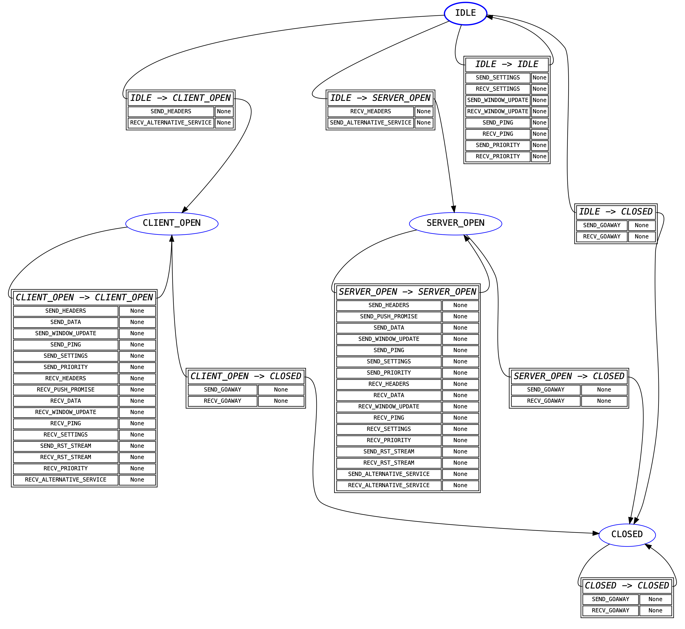

Low-Level Details
=================

.. warning:: This section of the documentation covers low-level implementation
             details of h2. This is most likely to be of use to h2
             developers and to other HTTP/2 implementers, though it could well
             be of general interest. Feel free to peruse it, but if you're
             looking for information about how to *use* h2 you should
             consider looking elsewhere.

State Machines
--------------

h2 is fundamentally built on top of a pair of interacting Finite State
Machines. One of these FSMs manages per-connection state, and another manages
per-stream state. Almost without exception (see :ref:`priority` for more
details) every single frame is unconditionally translated into events for
both state machines and those state machines are turned.

The advantages of a system such as this is that the finite state machines can
very densely encode the kinds of things that are allowed at any particular
moment in a HTTP/2 connection. However, most importantly, almost all protocols
are defined *in terms* of finite state machines: that is, protocol descriptions
can be reduced to a number of states and inputs. That makes FSMs a very natural
tool for implementing protocol stacks.

Indeed, most protocol implementations that do not explicitly encode a finite
state machine almost always *implicitly* encode a finite state machine, by
using classes with a bunch of variables that amount to state-tracking
variables, or by using the call-stack as an implicit state tracking mechanism.
While these methods are not immediately problematic, they tend to lack
*explicitness*, and can lead to subtle bugs of the form "protocol action X is
incorrectly allowed in state Y".

For these reasons, we have implemented two *explicit* finite state machines.
These machines aim to encode most of the protocol-specific state, in particular
regarding what frame is allowed at what time. This target goal is sometimes not
achieved: in particular, as of this writing the *stream* FSM contains a number
of other state variables that really ought to be rolled into the state machine
itself in the form of new states, or in the form of a transformation of the
FSM to use state *vectors* instead of state *scalars*.

The following sections contain some implementers notes on these FSMs.

Connection State Machine
~~~~~~~~~~~~~~~~~~~~~~~~

The "outer" state machine, the first one that is encountered when sending or
receiving data, is the connection state machine. This state machine tracks
whole-connection state.

This state machine is primarily intended to forbid certain actions on the basis
of whether the implementation is acting as a client or a server. For example,
clients are not permitted to send ``PUSH_PROMISE`` frames: this state machine
forbids that by refusing to define a valid transition from the ``CLIENT_OPEN``
state for the ``SEND_PUSH_PROMISE`` event.

Otherwise, this particular state machine triggers no side-effects. It has a
very coarse, high-level, functionality.

A visual representation of this FSM is shown below:

.. _stream-state-machine:

Stream State Machine
~~~~~~~~~~~~~~~~~~~~

Once the connection state machine has been spun, any frame that belongs to a
stream is passed to the stream state machine for its given stream. Each stream
has its own instance of the state machine, but all of them share the transition
table: this is because the table itself is sufficiently large that having it be
per-instance would be a ridiculous memory overhead.

Unlike the connection state machine, the stream state machine is quite complex.
This is because it frequently needs to encode some side-effects. The most
common side-effect is emitting a ``RST_STREAM`` frame when an error is
encountered: the need to do this means that far more transitions need to be
encoded than for the connection state machine.

Many of the side-effect functions in this state machine also raise
:class:`ProtocolError <h2.exceptions.ProtocolError>` exceptions. This is almost
always done on the basis of an extra state variable, which is an annoying code
smell: it should always be possible for the state machine itself to police
these using explicit state management. A future refactor will hopefully address
this problem by making these additional state variables part of the state
definitions in the FSM, which will lead to an expansion of the number of states
but a greater degree of simplicity in understanding and tracking what is going
on in the state machine.

The other action taken by the side-effect functions defined here is returning
:ref:`events <h2-events-basic>`. Most of these events are returned directly to
the user, and reflect the specific state transition that has taken place, but
some of the events are purely *internal*: they are used to signal to other
parts of the h2 codebase what action has been taken.

The major use of the internal events functionality at this time is for
validating header blocks: there are different rules for request headers than
there are for response headers, and different rules again for trailers. The
internal events are used to determine *exactly what* kind of data the user is
attempting to send, and using that information to do the correct kind of
validation. This approach ensures that the final source of truth about what's
happening at the protocol level lives inside the FSM, which is an extremely
important design principle we want to continue to enshrine in h2.

A visual representation of this FSM is shown below:

.. _priority:

Priority
~~~~~~~~

In the :ref:`stream-state-machine` section we said that any frame that belongs
to a stream is passed to the stream state machine. This turns out to be not
quite true.

Specifically, while ``PRIORITY`` frames are technically sent on a given stream
(that is, `RFC 7540 Section 6.3`_ defines them as "always identifying a stream"
and forbids the use of stream ID ``0`` for them), in practice they are almost
completely exempt from the usual stream FSM behaviour. Specifically, the RFC
has this to say:

    The ``PRIORITY`` frame can be sent on a stream in any state, though it
    cannot be sent between consecutive frames that comprise a single
    header block (Section 4.3).

Given that the consecutive header block requirement is handled outside of the
FSMs, this section of the RFC essentially means that there is *never* a
situation where it is invalid to receive a ``PRIORITY`` frame. This means that
including it in the stream FSM would require that we allow ``SEND_PRIORITY``
and ``RECV_PRIORITY`` in all states.

This is not a totally onerous task: however, another key note is that h2
uses the *absence* of a stream state machine to flag a closed stream. This is
primarily for memory conservation reasons: if we needed to keep around an FSM
for every stream we've ever seen, that would cause long-lived HTTP/2
connections to consume increasingly large amounts of memory. On top of this,
it would require us to create a stream FSM each time we received a ``PRIORITY``
frame for a given stream, giving a malicious peer an easy route to force a
h2 user to allocate nearly unbounded amounts of memory.

For this reason, h2 circumvents the stream FSM entirely for ``PRIORITY``
frames. Instead, these frames are treated as being connection-level frames that
*just happen* to identify a specific stream. They do not bring streams into
being, or in any sense interact with h2's view of streams. Their stream
details are treated as strictly metadata that h2 is not interested in
beyond being able to parse it out.

.. _RFC 7540 Section 6.3: https://tools.ietf.org/html/rfc7540#section-6.3
