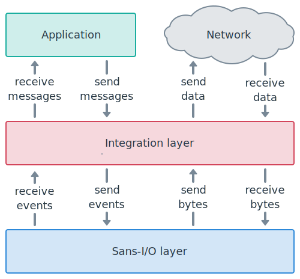

Integrate the Sans-I/O layer
============================

.. currentmodule:: websockets

This guide explains how to integrate the `Sans-I/O`_ layer of websockets to
add support for WebSocket in another library.

.. _Sans-I/O: https://sans-io.readthedocs.io/

As a prerequisite, you should decide how you will handle network I/O and
asynchronous control flow.

Your integration layer will provide an API for the application on one side,
will talk to the network on the other side, and will rely on websockets to
implement the protocol in the middle.

Opening a connection
--------------------

Client-side
...........

If you're building a client, parse the URI you'd like to connect to::

    from websockets.uri import parse_uri

    wsuri = parse_uri("ws://example.com/")

Open a TCP connection to ``(wsuri.host, wsuri.port)`` and perform a TLS
handshake if ``wsuri.secure`` is :obj:`True`.

Initialize a :class:`~client.ClientProtocol`::

    from websockets.client import ClientProtocol

    protocol = ClientProtocol(wsuri)

Create a WebSocket handshake request
with :meth:`~client.ClientProtocol.connect` and send it
with :meth:`~client.ClientProtocol.send_request`::

    request = protocol.connect()
    protocol.send_request(request)

Then, call :meth:`~protocol.Protocol.data_to_send` and send its output to
the network, as described in `Send data`_ below.

Once you receive enough data, as explained in `Receive data`_ below, the first
event returned by :meth:`~protocol.Protocol.events_received` is the WebSocket
handshake response.

When the handshake fails, the reason is available in
:attr:`~client.ClientProtocol.handshake_exc`::

    if protocol.handshake_exc is not None:
        raise protocol.handshake_exc

Else, the WebSocket connection is open.

A WebSocket client API usually performs the handshake then returns a wrapper
around the network socket and the :class:`~client.ClientProtocol`.

Server-side
...........

If you're building a server, accept network connections from clients and
perform a TLS handshake if desired.

For each connection, initialize a :class:`~server.ServerProtocol`::

    from websockets.server import ServerProtocol

    protocol = ServerProtocol()

Once you receive enough data, as explained in `Receive data`_ below, the first
event returned by :meth:`~protocol.Protocol.events_received` is the WebSocket
handshake request.

Create a WebSocket handshake response
with :meth:`~server.ServerProtocol.accept` and send it
with :meth:`~server.ServerProtocol.send_response`::

    response = protocol.accept(request)
    protocol.send_response(response)

Alternatively, you may reject the WebSocket handshake and return an HTTP
response with :meth:`~server.ServerProtocol.reject`::

    response = protocol.reject(status, explanation)
    protocol.send_response(response)

Then, call :meth:`~protocol.Protocol.data_to_send` and send its output to
the network, as described in `Send data`_ below.

Even when you call :meth:`~server.ServerProtocol.accept`, the WebSocket
handshake may fail if the request is incorrect or unsupported.

When the handshake fails, the reason is available in
:attr:`~server.ServerProtocol.handshake_exc`::

    if protocol.handshake_exc is not None:
        raise protocol.handshake_exc

Else, the WebSocket connection is open.

A WebSocket server API usually builds a wrapper around the network socket and
the :class:`~server.ServerProtocol`. Then it invokes a connection handler that
accepts the wrapper in argument.

It may also provide a way to close all connections and to shut down the server
gracefully.

Going forwards, this guide focuses on handling an individual connection.

From the network to the application
-----------------------------------

Go through the five steps below until you reach the end of the data stream.

Receive data
............

When receiving data from the network, feed it to the protocol's
:meth:`~protocol.Protocol.receive_data` method.

When reaching the end of the data stream, call the protocol's
:meth:`~protocol.Protocol.receive_eof` method.

For example, if ``sock`` is a :obj:`~socket.socket`::

    try:
        data = sock.recv(65536)
    except OSError:  # socket closed
        data = b""
    if data:
        protocol.receive_data(data)
    else:
        protocol.receive_eof()

These methods aren't expected to raise exceptions — unless you call them again
after calling :meth:`~protocol.Protocol.receive_eof`, which is an error.
(If you get an exception, please file a bug!)

Send data
.........

Then, call :meth:`~protocol.Protocol.data_to_send` and send its output to
the network::

    for data in protocol.data_to_send():
        if data:
            sock.sendall(data)
        else:
            sock.shutdown(socket.SHUT_WR)

The empty bytestring signals the end of the data stream. When you see it, you
must half-close the TCP connection.

Sending data right after receiving data is necessary because websockets
responds to ping frames, close frames, and incorrect inputs automatically.

Expect TCP connection to close
..............................

Closing a WebSocket connection normally involves a two-way WebSocket closing
handshake. Then, regardless of whether the closure is normal or abnormal, the
server starts the four-way TCP closing handshake. If the network fails at the
wrong point, you can end up waiting until the TCP timeout, which is very long.

To prevent dangling TCP connections when you expect the end of the data stream
but you never reach it, call :meth:`~protocol.Protocol.close_expected`
and, if it returns :obj:`True`, schedule closing the TCP connection after a
short timeout::

    # start a new execution thread to run this code
    sleep(10)
    sock.close()  # does nothing if the socket is already closed

If the connection is still open when the timeout elapses, closing the socket
makes the execution thread that reads from the socket reach the end of the
data stream, possibly with an exception.

Close TCP connection
....................

If you called :meth:`~protocol.Protocol.receive_eof`, close the TCP
connection now. This is a clean closure because the receive buffer is empty.

After :meth:`~protocol.Protocol.receive_eof` signals the end of the read
stream, :meth:`~protocol.Protocol.data_to_send` always signals the end of
the write stream, unless it already ended. So, at this point, the TCP
connection is already half-closed. The only reason for closing it now is to
release resources related to the socket.

Now you can exit the loop relaying data from the network to the application.

Receive events
..............

Finally, call :meth:`~protocol.Protocol.events_received` to obtain events
parsed from the data provided to :meth:`~protocol.Protocol.receive_data`::

    events = connection.events_received()

The first event will be the WebSocket opening handshake request or response.
See `Opening a connection`_ above for details.

All later events are WebSocket frames. There are two types of frames:

* Data frames contain messages transferred over the WebSocket connections. You
  should provide them to the application. See `Fragmentation`_ below for
  how to reassemble messages from frames.
* Control frames provide information about the connection's state. The main
  use case is to expose an abstraction over ping and pong to the application.
  Keep in mind that websockets responds to ping frames and close frames
  automatically. Don't duplicate this functionality!

From the application to the network
-----------------------------------

The connection object provides one method for each type of WebSocket frame.

For sending a data frame:

* :meth:`~protocol.Protocol.send_continuation`
* :meth:`~protocol.Protocol.send_text`
* :meth:`~protocol.Protocol.send_binary`

These methods raise :exc:`~exceptions.ProtocolError` if you don't set
the :attr:`FIN <websockets.frames.Frame.fin>` bit correctly in fragmented
messages.

For sending a control frame:

* :meth:`~protocol.Protocol.send_close`
* :meth:`~protocol.Protocol.send_ping`
* :meth:`~protocol.Protocol.send_pong`

:meth:`~protocol.Protocol.send_close` initiates the closing handshake.
See `Closing a connection`_ below for details.

If you encounter an unrecoverable error and you must fail the WebSocket
connection, call :meth:`~protocol.Protocol.fail`.

After any of the above, call :meth:`~protocol.Protocol.data_to_send` and
send its output to the network, as shown in `Send data`_ above.

If you called :meth:`~protocol.Protocol.send_close`
or :meth:`~protocol.Protocol.fail`, you expect the end of the data
stream. You should follow the process described in `Close TCP connection`_
above in order to prevent dangling TCP connections.

Closing a connection
--------------------

Under normal circumstances, when a server wants to close the TCP connection:

* it closes the write side;
* it reads until the end of the stream, because it expects the client to close
  the read side;
* it closes the socket.

When a client wants to close the TCP connection:

* it reads until the end of the stream, because it expects the server to close
  the read side;
* it closes the write side;
* it closes the socket.

Applying the rules described earlier in this document gives the intended
result. As a reminder, the rules are:

* When :meth:`~protocol.Protocol.data_to_send` returns the empty
  bytestring, close the write side of the TCP connection.
* When you reach the end of the read stream, close the TCP connection.
* When :meth:`~protocol.Protocol.close_expected` returns :obj:`True`, if
  you don't reach the end of the read stream quickly, close the TCP connection.

Fragmentation
-------------

WebSocket messages may be fragmented. Since this is a protocol-level concern,
you may choose to reassemble fragmented messages before handing them over to
the application.

To reassemble a message, read data frames until you get a frame where
the :attr:`FIN <websockets.frames.Frame.fin>` bit is set, then concatenate
the payloads of all frames.

You will never receive an inconsistent sequence of frames because websockets
raises a :exc:`~exceptions.ProtocolError` and fails the connection when this
happens. However, you may receive an incomplete sequence if the connection
drops in the middle of a fragmented message.

Tips
----

Serialize operations
....................

The Sans-I/O layer expects to run sequentially. If your interact with it from
multiple threads or coroutines, you must ensure correct serialization. This
should happen automatically in a cooperative multitasking environment.

However, you still have to make sure you don't break this property by
accident. For example, serialize writes to the network
when :meth:`~protocol.Protocol.data_to_send` returns multiple values to
prevent concurrent writes from interleaving incorrectly.

Avoid buffers
.............

The Sans-I/O layer doesn't do any buffering. It makes events available in
:meth:`~protocol.Protocol.events_received` as soon as they're received.

You should make incoming messages available to the application immediately and
stop further processing until the application fetches them. This will usually
result in the best performance.
