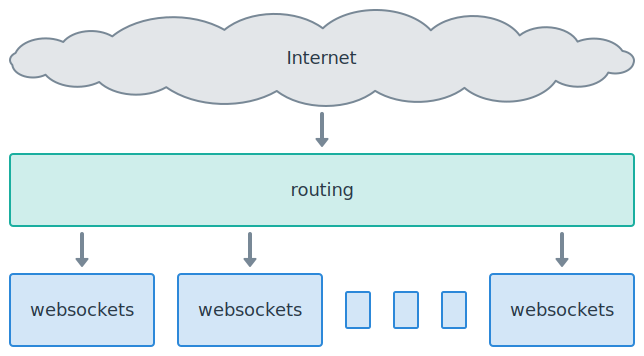

Deployment
==========

.. currentmodule:: websockets

When you deploy your websockets server to production, at a high level, your
architecture will almost certainly look like the following diagram:

The basic unit for scaling a websockets server is "one server process". Each
blue box in the diagram represents one server process.

There's more variation in routing. While the routing layer is shown as one big
box, it is likely to involve several subsystems.

When you design a deployment, your should consider two questions:

1. How will I run the appropriate number of server processes?
2. How will I route incoming connections to these processes?

These questions are strongly related. There's a wide range of acceptable
answers, depending on your goals and your constraints.

You can find a few concrete examples in the :ref:`deployment how-to guides
<deployment-howto>`.

Running server processes
------------------------

How many processes do I need?
.............................

Typically, one server process will manage a few hundreds or thousands
connections, depending on the frequency of messages and the amount of work
they require.

CPU and memory usage increase with the number of connections to the server.

Often CPU is the limiting factor. If a server process goes to 100% CPU, then
you reached the limit. How much headroom you want to keep is up to you.

Once you know how many connections a server process can manage and how many
connections you need to handle, you can calculate how many processes to run.

You can also automate this calculation by configuring an autoscaler to keep
CPU usage or connection count within acceptable limits.

Don't scale with threads. Threads doesn't make sense for a server built with
:mod:`asyncio`.

How do I run processes?
.......................

Most solutions for running multiple instances of a server process fall into
one of these three buckets:

1. Running N processes on a platform:

   * a Kubernetes Deployment

   * its equivalent on a Platform as a Service provider

2. Running N servers:

   * an AWS Auto Scaling group, a GCP Managed instance group, etc.

   * a fixed set of long-lived servers

3. Running N processes on a server:

   * preferably via a process manager or supervisor

Option 1 is easiest of you have access to such a platform.

Option 2 almost always combines with option 3.

How do I start a process?
.........................

Run a Python program that invokes :func:`~server.serve`. That's it.

Don't run an ASGI server such as Uvicorn, Hypercorn, or Daphne. They're
alternatives to websockets, not complements.

Don't run a WSGI server such as Gunicorn, Waitress, or mod_wsgi. They aren't
designed to run WebSocket applications.

Applications servers handle network connections and expose a Python API. You
don't need one because websockets handles network connections directly.

How do I stop a process?
........................

Process managers send the SIGTERM signal to terminate processes. Catch this
signal and exit the server to ensure a graceful shutdown.

Here's an example:

.. literalinclude:: ../../example/faq/shutdown_server.py
    :emphasize-lines: 12-15,18

When exiting the context manager, :func:`~server.serve` closes all connections
with code 1001 (going away). As a consequence:

* If the connection handler is awaiting
  :meth:`~server.WebSocketServerProtocol.recv`, it receives a
  :exc:`~exceptions.ConnectionClosedOK` exception. It can catch the exception
  and clean up before exiting.

* Otherwise, it should be waiting on
  :meth:`~server.WebSocketServerProtocol.wait_closed`, so it can receive the
  :exc:`~exceptions.ConnectionClosedOK` exception and exit.

This example is easily adapted to handle other signals.

If you override the default signal handler for SIGINT, which raises
:exc:`KeyboardInterrupt`, be aware that you won't be able to interrupt a
program with Ctrl-C anymore when it's stuck in a loop.

Routing connections
-------------------

What does routing involve?
..........................

Since the routing layer is directly exposed to the Internet, it should provide
appropriate protection against threats ranging from Internet background noise
to targeted attacks.

You should always secure WebSocket connections with TLS. Since the routing
layer carries the public domain name, it should terminate TLS connections.

Finally, it must route connections to the server processes, balancing new
connections across them.

How do I route connections?
...........................

Here are typical solutions for load balancing, matched to ways of running
processes:

1. If you're running on a platform, it comes with a routing layer:

   * a Kubernetes Ingress and Service

   * a service mesh: Istio, Consul, Linkerd, etc.

   * the routing mesh of a Platform as a Service

2. If you're running N servers, you may load balance with:

   * a cloud load balancer: AWS Elastic Load Balancing, GCP Cloud Load
     Balancing, etc.

   * A software load balancer: HAProxy, NGINX, etc.

3. If you're running N processes on a server, you may load balance with:

   * A software load balancer: HAProxy, NGINX, etc.

   * The operating system — all processes listen on the same port

You may trust the load balancer to handle encryption and to provide security.
You may add another layer in front of the load balancer for these purposes.

There are many possibilities. Don't add layers that you don't need, though.

How do I implement a health check?
..................................

Load balancers need a way to check whether server processes are up and running
to avoid routing connections to a non-functional backend.

websockets provide minimal support for responding to HTTP requests with the
:meth:`~server.WebSocketServerProtocol.process_request` hook.

Here's an example:

.. literalinclude:: ../../example/faq/health_check_server.py
    :emphasize-lines: 7-9,18
