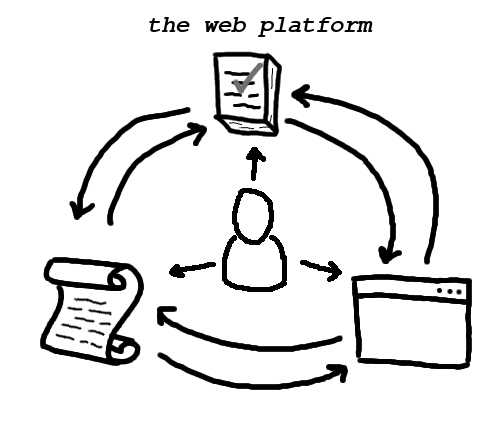

# "Introduction to WPT" video transcript

<iframe
  width="560"
  height="315"
  src="https://www.youtube.com/embed/zuK1uyXPZS0"
  frameborder="0"
  allow="autoplay; encrypted-media"
  allowfullscreen></iframe>

**Still image of the WPT logo. The song ["My
Luck"](http://brokeforfree.bandcamp.com/track/my-luck) by [Broke for
Free](http://brokeforfree.com/) (licensed under [Creative Commons Attribution
3.0](https://creativecommons.org/licenses/by/3.0/))
plays in the background.**

> Hello, and welcome to the Web Platform Tests!
>
> The goal of this project is to ensure that all web browsers present websites
> in exactly the way the authors intended.
>
> But what is the web platform, exactly? You can think of it as having three
> main parts.

**A top-down shot of a blank sheet of graph paper**

> First, there are the web browsers.

A hand places a paper cutout depicting a browser window in the lower-right
corner of the sheet.

> Applications like Firefox, Chrome, and Safari allow people to interact with
> pages and with each other.
>
> Second, there are the web standards.

A hand places a paper cutout depicting a scroll of parchment paper in the
lower-left corner of the sheet.

> These documents define how the browsers are supposed to behave.

**A screen recording of a web browser**

`https://platform.html5.org` is entered into the location bar, and the browser
loads the page.

> That includes everything from how text is rendered to how augmented reality
> apps are built. Specifying it all takes a lot of work!

The browser clicks through to the Fetch standard and begins scrolling.

> And as you might expect, the standards can get really complicated.

**Return to the graph paper**

A hand draws an arrow from the cutout of the scroll to the cutout of the
browser window.

> The people who build the browsers use the specifications as a blue print for
> their work. A shared set of generic instructions like these make it possible
> for people to choose between different browsers, but only if the browsers get
> it right.

A hand places a cutout representing a stack of papers on the top-center of the
sheet and draws an arrow from that cutout to the cutout of the browser window.

> To verify their work, the browser maintainers rely on the third part of the
> web platform: conformance tests.

A hand draws an arrow from the cutout of the scroll to the cutout of the tests.

> We author tests to describe the same behavior as the standards, just
> formatted in a way that a computer can understand.

A hand draws an arrow from the cutout of the browser window to the cutout of
the scroll.

> In the process, the maintainers sometimes uncover problems in the design of
> the specifications, and they recommend changes to fix them.

A hand draws an arrow from the cutout of the tests to the cutout of the scroll.

> Test authors also find and fix these so-called "spec bugs."

A hand draws an arrow from the cutout of the browser window to the cutout of
the tests.

> ...and as they implement the standards, the maintainers of each browser
> frequently write new tests that can be shared with the others.
>
> This is how thousands of people coordinate to build the cohesive programming
> platform that we call the world wide web. The web-platform-tests project is
> one of the test suites that make this possible.
>
> That's pretty abstract, though! Let's take a quick look at the tests
> themselves.

**A screen recording of a web browser**

`http://wpt.live` is entered into the location bar, and the browser loads the
page.

> The latest version of the tests is publicly hosted in executable form on the
> web at wpt.live.

The browser begins scrolling through the enormous list of directories.

> There, were can navigate among all the tests for all the different web
> technologies.
>
> Let's take a look at a typical test.

The browser stops scrolling, and a mouse cursor clicks on `fetch`, then `api`,
then `headers`, and finally `headers-basic.html`.

> This test is written with the web-platform-tests's testing framework,
> testharness.js. The test completes almost instantly, and testharness.js
> reports that this browser passes all but one subtest. To understand the
> failure, we can read the source code.

The mouse opens a context menu, selects "View Source", and scrolls to the
source of the failing test.

> It looks like the failing subtest is for what happens when a `Headers`
> instance has a custom JavaScript iterator method. That's a strange edge case,
> but it's important for browsers to agree on every detail!

The mouse clicks on the browser's "Back" button and then navigates through the
directory structure to the test at
`css/css-transforms/transform-transformed-tr-contains-fixed-position.html`. It
displays text rendered at an angle.

> Many tests don't use testharness.js at all. Let's take a look at a couple
> other test types.
>
> When it comes to the visual appearance of a page, it can be hard to verify
> the intended behavior using JavaScript alone. For these situations, the
> web-platform-tests uses what's known as a reftest.
>
> Short for "reference test", this type of test uses at least two different web
> pages.
>
> The first page demonstrates the feature under test.

The mouse opens a context menu, selects "View Source", and clicks on the `href`
value for the matching reference. It looks identical to the previous page.

> Inside of it, we'll find a link to a second page. This second page is the
> reference page. It's designed to use a different approach to produce the same
> output.

The mouse clicks back and forth between the browser tabs displaying the test
page and the reference page.

> When tests like these are run automatically, a computer verifies that
> screenshots of the two pages are identical.

The mouse clicks on the browser's "Back" button and then navigates through the
directory structure to the test at
`css/css-animations/animation-fill-mode-002-manual.html`. The page includes the
text, "Test passes if there is a filled color square with 'Filler Text', whose
color gradually changes in the order: YELLOW to GREEN." It also includes the
described animated square.

> Even with testharness.js and reftests, there are many web platform features
> that a computer can't automatically verify. In cases like these, we fall back
> to using manual tests.
>
> Manual tests can only be verified by a living, breathing human. They describe
> their expectations in plain English so that a human operator can easily
> determine whether the browser is behaving correctly.

`https://web-platform-tests.org` is entered into the location bar, and the
browser loads the page.

> You can read more about all the test types in the project documentation at
> [web-platform-tests.org](https://web-platform-tests.org).

`https://wpt.fyi` is entered into the location bar, and the browser loads the
page.

> [wpt.fyi](https://wpt.fyi) is a great way to see how today's browsers are
> performing on the web-platform-tests.

The browser scrolls to `fetch`, and a mouse cursor clicks on `fetch`, then
`api`, then `headers`, and finally `headers-basic.html`.

> Here, you'll find all the same tests, just presented with the results from
> various browsers.

`https://web-platform-tests.live/LICENSE.md` is entered into the location bar,
and the browser loads the page.

> The web-platform-tests project is free and open source software. From bug
> reports to documentation improvements and brand new tests, we welcome all
> sorts of contributions from everyone.

`https://github.com/web-platform-tests/wpt` is entered into the location bar,
and the browser loads the page.

> To get involved, you can visit the project management website hosted on
> GitHub.com.

The browser navigates to the project's "issues" list and filters the list for
just the ones labeled as "good first issue."

> Some issues are more difficult than others, but many are perfect for people who
> are just getting started with the project. When we come across an issue like
> that, we label it as a "good first issue."

`https://lists.w3.org/Archives/Public/public-test-infra` is entered into the
location bar, and the browser loads the page.

> You can also join the mailing list to receive e-mail with announcements and
> discussion about the project.

`http://irc.w3.org/` is entered into the location bar, and the browser loads
the page. `web4all` is entered as the Nickname, and `#testing` is entered as
the channel name. A mouse clicks on the "Connect" button.

> For more immediate communication, you can join the "testing" channel on the
> IRC server run by the W3C.

**Return to the graph paper**

A hand places a paper cutout depicting a human silhouette on the sheet. It then
draws arrows from the new cutout to each of the three previously-introduced
cutouts.

> We're looking forward to working with you!
