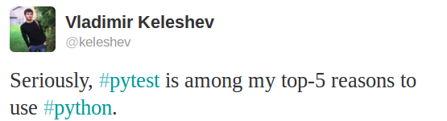

.. _projects:

.. image:: img/gaynor3.png
   :width: 400px
   :align: right

.. image:: img/cramer2.png
   :width: 400px
   :align: right

Project examples
==========================

Here are some examples of projects using ``pytest`` (please send notes via :ref:`contact`):

* `PyPy <http://pypy.org>`_, Python with a JIT compiler, running over
  `21000 tests <http://buildbot.pypy.org/summary?branch=%3Ctrunk%3E>`_
* the `MoinMoin <http://moinmo.in>`_ Wiki Engine
* `sentry <https://getsentry.com/welcome/>`_, realtime app-maintenance and exception tracking
* `Astropy <http://www.astropy.org/>`_ and `affiliated packages <http://www.astropy.org/affiliated/index.html>`_
* `tox <http://testrun.org/tox>`_, virtualenv/Hudson integration tool
* `PIDA <http://pida.co.uk>`_ framework for integrated development
* `PyPM <http://code.activestate.com/pypm/>`_ ActiveState's package manager
* `Fom <http://packages.python.org/Fom/>`_ a fluid object mapper for FluidDB
* `applib <https://github.com/ActiveState/applib>`_ cross-platform utilities
* `six <http://pypi.python.org/pypi/six/>`_ Python 2 and 3 compatibility utilities
* `pediapress <http://code.pediapress.com/wiki/wiki>`_ MediaWiki articles
* `mwlib <http://pypi.python.org/pypi/mwlib>`_ mediawiki parser and utility library
* `The Translate Toolkit <http://translate.sourceforge.net/wiki/toolkit/index>`_ for localization and conversion
* `execnet <http://codespeak.net/execnet>`_ rapid multi-Python deployment
* `pylib <http://py.rtfd.org>`_ cross-platform path, IO, dynamic code library
* `Pacha <http://pacha.cafepais.com/>`_ configuration management in five minutes
* `bbfreeze <http://pypi.python.org/pypi/bbfreeze>`_ create standalone executables from Python scripts
* `pdb++ <http://bitbucket.org/antocuni/pdb>`_ a fancier version of PDB
* `py-s3fuse <http://code.google.com/p/py-s3fuse/>`_ Amazon S3 FUSE based filesystem
* `waskr <http://code.google.com/p/waskr/>`_ WSGI Stats Middleware
* `guachi <http://code.google.com/p/guachi/>`_ global persistent configs for Python modules
* `Circuits <http://pypi.python.org/pypi/circuits>`_ lightweight Event Driven Framework
* `pygtk-helpers <http://bitbucket.org/aafshar/pygtkhelpers-main/>`_ easy interaction with PyGTK
* `QuantumCore <http://quantumcore.org/>`_ statusmessage and repoze openid plugin
* `pydataportability <http://pydataportability.net/>`_ libraries for managing the open web
* `XIST <http://www.livinglogic.de/Python/xist/>`_ extensible HTML/XML generator
* `tiddlyweb <http://pypi.python.org/pypi/tiddlyweb>`_ optionally headless, extensible RESTful datastore
* `fancycompleter <http://bitbucket.org/antocuni/fancycompleter/src>`_ for colorful tab-completion
* `Paludis <http://paludis.exherbo.org/>`_ tools for Gentoo Paludis package manager
* `Gerald <http://halfcooked.com/code/gerald/>`_ schema comparison tool
* `abjad <http://code.google.com/p/abjad/>`_ Python API for Formalized Score control
* `bu <http://packages.python.org/bu/>`_ a microscopic build system
* `katcp <https://bitbucket.org/hodgestar/katcp>`_ Telescope communication protocol over Twisted
* `kss plugin timer <http://pypi.python.org/pypi/kss.plugin.timer>`_
* `pyudev <https://pyudev.readthedocs.io/en/latest/tests/plugins.html>`_ a pure Python binding to the Linux library libudev
* `pytest-localserver <https://bitbucket.org/pytest-dev/pytest-localserver/>`_ a plugin for pytest that provides an httpserver and smtpserver
* `pytest-monkeyplus <http://pypi.python.org/pypi/pytest-monkeyplus/>`_ a plugin that extends monkeypatch

These projects help integrate ``pytest`` into other Python frameworks:

* `pytest-django <http://pypi.python.org/pypi/pytest-django/>`_ for Django
* `zope.pytest <http://packages.python.org/zope.pytest/>`_ for Zope and Grok
* `pytest_gae <http://pypi.python.org/pypi/pytest_gae/0.2.1>`_ for Google App Engine
* There is `some work <https://github.com/Kotti/Kotti/blob/master/kotti/testing.py>`_ underway for Kotti, a CMS built in Pyramid/Pylons

Some organisations using pytest
-----------------------------------

* `Square Kilometre Array, Cape Town <http://ska.ac.za/>`_
* `Some Mozilla QA people <http://www.theautomatedtester.co.uk/blog/2011/pytest_and_xdist_plugin.html>`_ use pytest to distribute their Selenium tests
* `Tandberg <http://www.tandberg.com/>`_
* `Shootq <http://web.shootq.com/>`_
* `Stups department of Heinrich Heine University Duesseldorf <http://www.stups.uni-duesseldorf.de/projects.php>`_
* `cellzome <http://www.cellzome.com/>`_
* `Open End, Gothenborg <http://www.openend.se>`_
* `Laboratory of Bioinformatics, Warsaw <http://genesilico.pl/>`_
* `merlinux, Germany <http://merlinux.eu>`_
* `ESSS, Brazil <http://www.esss.com.br>`_
* many more ... (please be so kind to send a note via :ref:`contact`)
