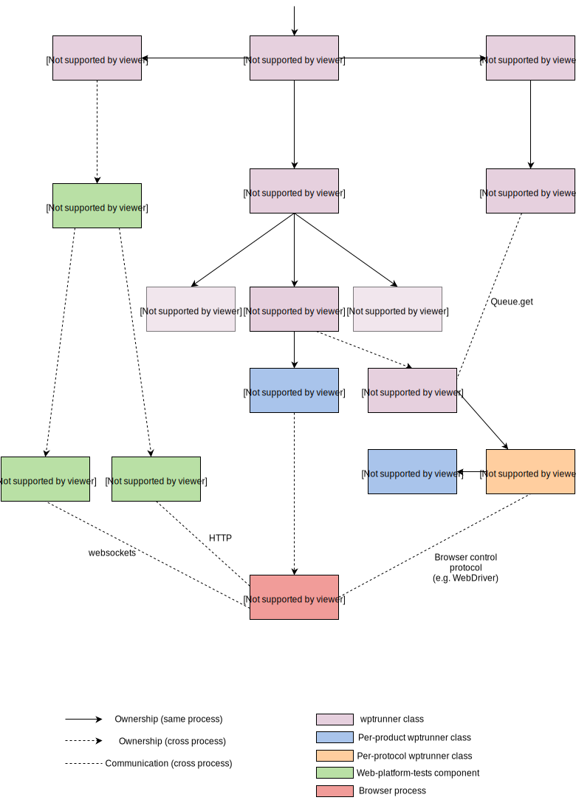

wptrunner Design
================

The design of wptrunner is intended to meet the following
requirements:

 * Possible to run tests from W3C web-platform-tests.

 * Tests should be run as fast as possible. In particular it should
   not be necessary to restart the browser between tests, or similar.

 * As far as possible, the tests should run in a "normal" browser and
   browsing context. In particular many tests assume that they are
   running in a top-level browsing context, so we must avoid the use
   of an ``iframe`` test container.

 * It must be possible to deal with all kinds of behaviour of the
   browser under test, for example, crashing, hanging, etc.

 * It should be possible to add support for new platforms and browsers
   with minimal code changes.

 * It must be possible to run tests in parallel to further improve
   performance.

 * Test output must be in a machine readable form.

Architecture
------------

In order to meet the above requirements, wptrunner is designed to
push as much of the test scheduling as possible into the harness. This
allows the harness to monitor the state of the browser and perform
appropriate action if it gets into an unwanted state e.g. kill the
browser if it appears to be hung.

The harness will typically communicate with the browser via some remote
control protocol such as WebDriver. However for browsers where no such
protocol is supported, other implementation strategies are possible,
typically at the expense of speed.

The overall architecture of wptrunner is shown in the diagram below:

.. currentmodule:: wptrunner

The main entry point to the code is :py:func:`~wptrunner.run_tests` in
``wptrunner.py``. This is responsible for setting up the test
environment, loading the list of tests to be executed, and invoking
the remainder of the code to actually execute some tests.

The test environment is encapsulated in the
:py:class:`~environment.TestEnvironment` class. This defers to code in
``web-platform-tests`` which actually starts the required servers to
run the tests.

The set of tests to run is defined by the
:py:class:`~testloader.TestLoader`. This is constructed with a
:py:class:`~testloader.TestFilter` (not shown), which takes any filter arguments
from the command line to restrict the set of tests that will be
run. The :py:class:`~testloader.TestLoader` reads both the ``web-platform-tests``
JSON manifest and the expectation data stored in ini files and
produces a :py:class:`multiprocessing.Queue` of tests to run, and
their expected results.

Actually running the tests happens through the
:py:class:`~testrunner.ManagerGroup` object. This takes the :py:class:`~multiprocessing.Queue` of
tests to be run and starts a :py:class:`~testrunner.TestRunnerManager` for each
instance of the browser under test that will be started. These
:py:class:`~testrunner.TestRunnerManager` instances are each started in their own
thread.

A :py:class:`~testrunner.TestRunnerManager` coordinates starting the product under
test, and outputting results from the test. In the case that the test
has timed out or the browser has crashed, it has to restart the
browser to ensure the test run can continue. The functionality for
initialising the browser under test, and probing its state
(e.g. whether the process is still alive) is implemented through a
:py:class:`~browsers.base.Browser` object. An implementation of this class must be
provided for each product that is supported.

The functionality for actually running the tests is provided by a
:py:class:`~testrunner.TestRunner` object. :py:class:`~testrunner.TestRunner` instances are
run in their own child process created with the
:py:mod:`multiprocessing` module. This allows them to run concurrently
and to be killed and restarted as required. Communication between the
:py:class:`~testrunner.TestRunnerManager` and the :py:class:`~testrunner.TestRunner` is
provided by a pair of queues, one for sending messages in each
direction. In particular test results are sent from the
:py:class:`~testrunner.TestRunner` to the :py:class:`~testrunner.TestRunnerManager` using one
of these queues.

The :py:class:`~testrunner.TestRunner` object is generic in that the same
:py:class:`~testrunner.TestRunner` is used regardless of the product under
test. However the details of how to run the test may vary greatly with
the product since different products support different remote control
protocols (or none at all). These protocol-specific parts are placed
in the :py:class:`~executors.base.TestExecutor` object. There is typically a different
:py:class:`~executors.base.TestExecutor` class for each combination of control protocol
and test type. The :py:class:`~testrunner.TestRunner` is responsible for pulling
each test off the :py:class:`multiprocessing.Queue` of tests and passing it down to
the :py:class:`~executors.base.TestExecutor`.

The executor often requires access to details of the particular
browser instance that it is testing so that it knows e.g. which port
to connect to to send commands to the browser. These details are
encapsulated in the :py:class:`~browsers.base.ExecutorBrowser` class.
